\begin{center}

# `biblio` - A Library Management System

---

\vspace{2cm}

## Abstract

Biblio - A Library Management System project aims to create a comprehensive solution for library management, targeting the needs of a librarian. This system facilitates the efficient handling of book inventories, including the addition and consolidation of new book orders. It allows for effortless filtering of books by various attributes such as author, publisher, and genre. The system streamlines the borrowing and returning process, ensures meticulous tracking of transactions, and handles fines for overdue books. Additionally, it maintains accurate records of authors, publishers, and patrons, while providing real-time library statistics. The application is designed to be user-friendly and supports containerized deployment for seamless integration and operation.

============================================================

<br>
<br>

### Requirement Collection

The Library Management System must consist of a LIBRARY database that comprehensively track all books, each identified by an ISBN, and record details such as title, author, publisher, publication year, and genre. Separate sections for authors and publishers are necessary, including full names for authors and names for publishers. Managing the book inventory, including the number of copies, availability status, and overdue status, is essential. Patron information, including name, address, phone number, email, and unique student numbers (USNs) for students, must be accurately stored. The system must track which patrons borrow which books, recording check-out and return dates, and apply fines for late returns. It should distinguish between active and inactive patrons, facilitate the easy addition of new books and patrons while avoiding duplicates, and allow straightforward searches for books by author or genre. A user-friendly interface with intuitive navigation for staff members is required. The system should provide access to library statistics, such as the number of checked-out books and popular genres, and support updating or deleting outdated or incorrect records. Additionally, managing different editions of books with the same title must ensure they are not confused.

### Requirement Analysis
Here is a dissected list of requirements for the Library Management System from a client:

1. It is necessary to keep track of all books. Each book should have its own ISBN number, title, author, publisher, publication year, and genre.

2. Separate sections for authors and publishers are required. For authors, their full names should be included. For publishers, their names are needed.

3. Managing the book inventory is essential, including the number of copies of each book, their availability status (available or checked out), and whether they are overdue.

4. Storing information about patrons, including name, address, phone number, and email, is necessary. For students, their unique student numbers (USNs) must be stored and ensured for accuracy.

5. Keeping track of which patrons are borrowing which books is crucial. This includes recording when a book is checked out and returned. If a book is returned late, a fine should be charged.

6. It should be easy to see which patrons currently have books checked out ("active") and which ones do not ("inactive").

7. Frequently acquiring new books and new patrons means the system must allow easy additions while avoiding duplicates.

8. The ability to search for books easily is necessary. For example, finding all books by a certain author or in a specific genre should be straightforward.

9. The system should have a user-friendly interface, with intuitive buttons and menus to facilitate ease of use by all staff members.

10. Accessing statistics about the library, such as the number of books currently checked out and the most popular genres, will aid in planning.

11. The ability to update information, such as a patron’s address or correcting a book title, is needed. Outdated or incorrect records should also be deletable.

12. Managing different publications of books with the same title is essential, ensuring they are not mixed up.

Through surveys and observations, it was determined that the end user of such an application would be a Librarian. The Librarian might use manual methods or IoT-enhanced techniques to enter inventory identifiers to facilitate issues, returns, and fine collection. On receiving book orders, the author, the publisher of the said book(s) are added to the database if not already there to enhance ease of filtering books required by a patron, without having to go through tedious manual searches throughout the library racks.

Here are the requirements that were determined from requirement collection:

- Addition and consolidation of book orders received by the Library. 

- Effortless filtering of books by attributes like author name, publisher, genre and the like.

- Enabling easy borrows and returns by patrons. Meticulous tracking of such transactions.

- Auto-incremented indexable and searchable IDs for authors, publishers and transactions.

- Consistent use of ISBN-13 format throughout all book records.

- Tracking patron status as Active or Inactive (Active being posession of a library book, and Inactive being the lack thereof).

- Addition of patrons should not allow duplication of Authors, Patron phone numbers, IDs or email IDs.

- Validation for VTU USNs (Patron IDs) for student patrons in the educational institution.

- Tracking book copies as available, or overdue, avoiding conflict in transaction.

- Year-of-publishing-wise maintenance of the book database to avoid erroneous categorization of a book with different editions.

- Fine increment on exceeding borrow period without renewal.

- Easily accessbile real-time library statistics.

- Containerized deployment with a strongly connected backend and a frontend.

- Update and Delete operations for all relevant entities.

- Worker functions to add fines, regularly list due books, and such time-related operations should remain functional during server uptime.

---

### Data Requirements and Functional Requirements

#### Data Requirements

1. **Books**: Each book should have an ISBN, title, author, publisher, publication year, and genre.
2. **Authors**: Full names required.
3. **Publishers**: Names required.
4. **Book Inventory**: Track the number of copies, availability status, and overdue status.
5. **Patrons**: Store name, address, phone number, email, and unique student numbers (USNs) for students.
6. **Transactions**: Track borrowing and returning of books, including check-out and return dates.
7. **Fines**: Track and apply fines for overdue books.
8. **Status**: Distinguish between active and inactive patrons.
9. **Search Functionality**: Allow searching for books by author or genre.
10. **Statistics**: Provide real-time library statistics.

#### Functional Requirements

1. **Addition and consolidation of book orders**.
2. **Filtering of books by author, publisher, genre, etc.**.
3. **Borrowing and returning of books by patrons**.
4. **Meticulous tracking of transactions**.
5. **Auto-incremented IDs for authors, publishers, and transactions**.
6. **Consistent use of ISBN-13 format**.
7. **Track active and inactive patron status**.
8. **Prevent duplication of authors, patrons (phone numbers, IDs, emails)**.
9. **Validation of VTU USNs**.
10. **Track availability and overdue status of book copies**.
11. **Maintain book database year-wise**.
12. **Fine increment on exceeding borrow period**.
13. **Provide real-time library statistics**.
14. **Containerized deployment**.
15. **Update and delete operations for all relevant entities**.
16. **Worker functions for time-related operations**.

---

### Entity-Relationship Diagram


---

## Conversion to a Relational Model - Using the seven-step algorithm for ER diagram conversion

#### 1. Map Regular Entities

Relations included:
 - Patron 
 - Publisher
 - Author
 - Book
 - BookCopy

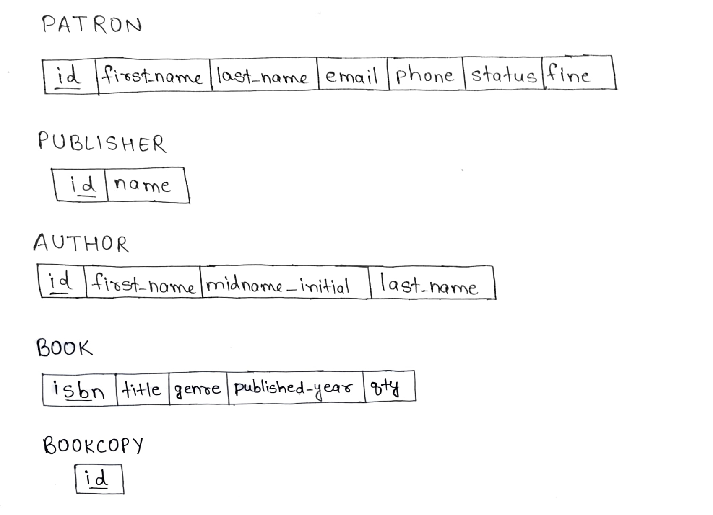{ width=50% }

#### 2. Map Weak Entities

Since there are no weak entities in this ER diagram, this step is skipped.

#### 3. Map Binary 1:1 Relationships

Since there are no 1:1 relationships in this diagram, this step is skipped.

#### 4. Map Binary 1:N Relationships

  - Add `author_id` as a foreign key to the `Book` table.
  - Add `publisher_id` as a foreign key to the `Book` table.
  - Add `isbn` as a foreign key to the `BookCopy` table.

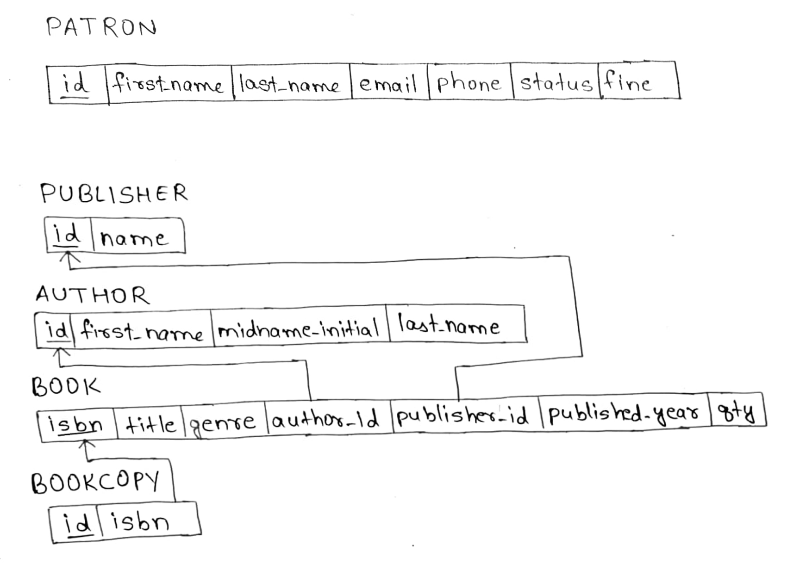{ width=50% }

#### 5. Map Binary M:N Relationships

  - Create relation: `Borrows(id, patron_id, copy_id, borrow_date, due_date, return_date)`
  - Primary key: `id`
  - Foreign keys: `patron_id` references `Patron(id)`, `copy_id` references `BookCopy(id)`

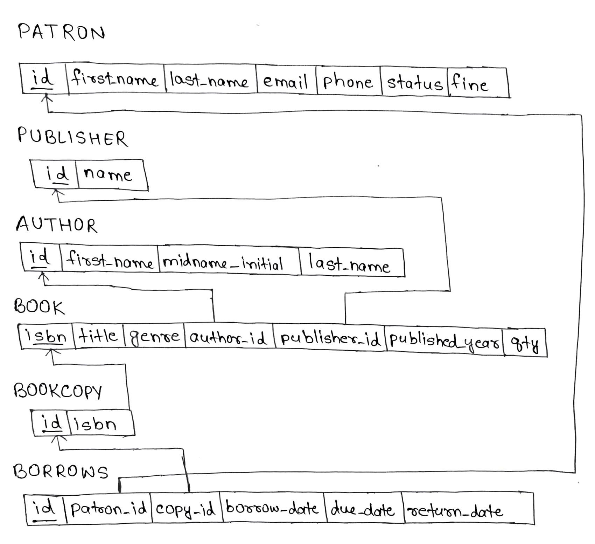{ width=50% }

#### 6. Map Multivalued Attributes

Since there are no multivalued attributes in this ER diagram, this step is skipped.
_It could be considered the the Author and Publisher attributes for a book are multi-valued. However, referring to the requirements, we see that it was mentioned that effortless filtering of books by author, publisher and genre was a required feature already._

#### 7. Map N-ary Relationships

Since there are no n-ary (n > 2) relationships in this diagram, this step is skipped.

### Additional Considerations

#### 1. Composite Attributes

Split composite attributes into their components:
- **Patron:** Split `name` into `first_name` and `last_name`.
- **Author:** Split `name` into `first_name`, `midname_initial`, and `last_name`.

#### 2. Data Types

Assign appropriate data types to each attribute based on the nature of the data it will store. For example:
- Used `VARCHAR` for variable-length string data (names, email, etc.).
- Used `INTEGER` for numeric data (id, qty, etc.).
- Used `DATE` for date fields (borrow_date, due_date, return_date).

#### 3. Constraints

Added constraints to ensure data integrity:
- Set `NOT NULL` for mandatory fields.
- Added `UNIQUE` constraints where appropriate (e.g., `email` in the `Patron` table).
- Defined `CHECK` constraints for fields with limited values (e.g., `status` in the `Patron` table).

#### 4. Indexes

Created indexes on frequently queried fields to improve performance.

---

### Final Relational Schema
The final relational schema is as follows:

{ width=50% }

---

### Relational Tables with sample instances

Here are all the tables straightened and aligned:

#### Patron

| id         | first_name | last_name | email                             | phone      | status | fine |
|------------|------------|-----------|-----------------------------------|------------|--------|------|
| 1MS22IS079 | Mohit      | Nair      | themohitnair@protonmail.com       | 8073273865 | IN     | 32   |
| 1MS22IS125 | Shashank   | Bharadwaj | shanksb0001@gmail.com             | 1234567890 | AC     | 0    |
| 1MS22IS138 | Suchit     | G         | suchitg123@gmail.com              | 1098765432 | AC     | 0    |

#### Publisher

| id | name            |
|----|-----------------|
| 1  | Wiley           |
| 2  | Addison-Wesley  |
| 3  | Pearson         |
| 4  | McGraw-Hill     |

#### Author

| id | first_name | midname_initial | last_name |
|----|------------|-----------------|-----------|
| 1  | Carl       | V               | Hamacher  |
| 2  | Shamkant   | B               | Navathe   |
| 3  | Lyla       | B               | Das       |

#### Book

| isbn           | title                                        | genre     | author_id | publisher_id | published_year | qty |
|----------------|----------------------------------------------|-----------|-----------|--------------|----------------|-----|
| 9780072320862  | Computer Organization                        | hardware  | 1         | 1            | 2002           | 2   |
| 9780130224570  | Embedded Systems: An Integrated Approach     | hardware  | 3         | 3            | 2001           | 2   |
| 9780133970777  | Fundamentals of Database Systems             | database  | 2         | 2            | 2011           | 2   |

#### BookCopy

| id | isbn           |
|----|----------------|
| 1  | 9780072320862  |
| 2  | 9780072320862  |
| 3  | 9780130224570  |
| 4  | 9780130224570  |
| 5  | 9780133970777  |
| 6  | 9780133970777  |

#### Borrows

| id | patron_id  | copy_id | borrow_date | due_date   | return_date |
|----|------------|---------|-------------|------------|-------------|
| 1  | 1MS22IS125 | 1       | 2024-06-20  | 2024-07-05 | NULL        |
| 2  | 1MS22IS138 | 3       | 2024-06-25  | 2024-07-10 | NULL        |
| 3  | 1MS22IS079 | 5       | 2024-06-15  | 2024-06-30 | 2024-06-28  |

--- 

### Entity-wise functional dependencies

#### Relation: Patron

| Attribute | Description           |
|-----------|-----------------------|
| id        | Unique identifier     |
| first_name| First name of patron  |
| last_name | Last name of patron   |
| email     | Email of patron       |
| phone     | Phone number of patron|
| status    | Active/Inactive status|
| fine      | Outstanding fine      |

**Functional Dependencies:**

1. `id -> first_name, last_name, email, phone, status, fine`
2. `email -> id, first_name, last_name, phone, status, fine`
3. `phone -> id, first_name, last_name, email, status, fine`

#### Relation: Publisher

| Attribute | Description           |
|-----------|-----------------------|
| id        | Unique identifier     |
| name      | Name of the publisher |

**Functional Dependencies:**

1. `id -> name`
2. `name -> id`

#### Relation: Author

| Attribute      | Description                 |
|----------------|-----------------------------|
| id             | Unique identifier           |
| first_name     | First name of author        |
| midname_initial| Middle name initial of author|
| last_name      | Last name of author         |

**Functional Dependencies:**

1. `id -> first_name, midname_initial, last_name`
2. `first_name, midname_initial, last_name -> id`

#### Relation: Book

| Attribute     | Description                     |
|---------------|---------------------------------|
| isbn          | Unique identifier (ISBN)        |
| title         | Title of the book               |
| genre         | Genre of the book               |
| author_id     | Foreign key to Author table     |
| publisher_id  | Foreign key to Publisher table  |
| published_year| Year the book was published     |
| qty           | Quantity of copies available    |

**Functional Dependencies:**

1. `isbn -> title, genre, author_id, publisher_id, published_year, qty`

#### Relation: BookCopy

| Attribute | Description          |
|-----------|----------------------|
| id        | Unique identifier    |
| isbn      | Foreign key to Book  |

**Functional Dependencies:**

1. `id -> isbn`

#### Relation: Borrows

| Attribute    | Description                    |
|--------------|--------------------------------|
| id           | Unique identifier              |
| patron_id    | Foreign key to Patron table    |
| copy_id      | Foreign key to BookCopy table  |
| borrow_date  | Date the book was borrowed     |
| due_date     | Date the book is due to return |
| return_date  | Date the book was returned     |

**Functional Dependencies:**

1. `id -> patron_id, copy_id, borrow_date, due_date, return_date`
2. `patron_id, copy_id -> borrow_date, due_date, return_date` 

---

### Analysis against Normal Forms (first normal form, second normal form, third normal form, and the Boyle-Codd normal form)

1. Patron:
   - 1NF: Yes, all attributes are atomic.
   - 2NF: Yes, all non-key attributes depend on the entire primary key (id).
   - 3NF: Yes, no transitive dependencies.

2. Publisher:
   - 1NF: Yes, all attributes are atomic.
   - 2NF: Yes, all non-key attributes depend on the entire primary key (id).
   - 3NF: Yes, no transitive dependencies.

3. Author:
   - 1NF: Yes, all attributes are atomic.
   - 2NF: Yes, all non-key attributes depend on the entire primary key (id).
   - 3NF: Yes, no transitive dependencies.

4. Book:
   - 1NF: Yes, all attributes are atomic.
   - 2NF: Yes, all non-key attributes depend on the entire primary key (isbn).
   - 3NF: Yes, no transitive dependencies.

5. BookCopy:
   - 1NF: Yes, all attributes are atomic.
   - 2NF: Yes, all non-key attributes depend on the entire primary key (id).
   - 3NF: Yes, no transitive dependencies.

6. Borrows:
   - 1NF: Yes, all attributes are atomic.
   - 2NF: Yes, all non-key attributes depend on the entire primary key (id).
   - 3NF: Yes, no transitive dependencies.

Thus, the relational schema is overall in the Third Normal Form

---

### Relational Algebra Representation of Database Queries

1. Retrieve all book copies that are currently available for borrowing.

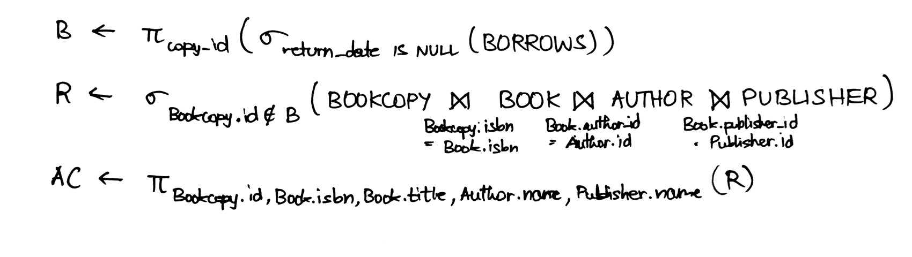

2. Retrieve books written by a specific author, identified by their full name (first, middle initial, and last name).

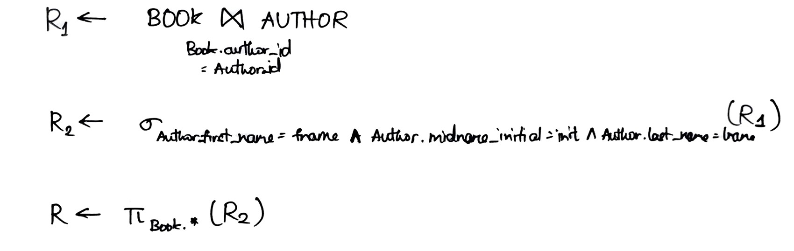

3. List all the borrow transactions in the system, including current and past borrows.

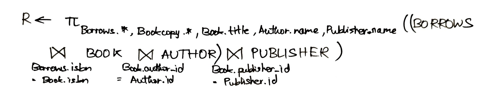

4. Return all the borrow transactions associated with a specific patron, identified by their patron ID.

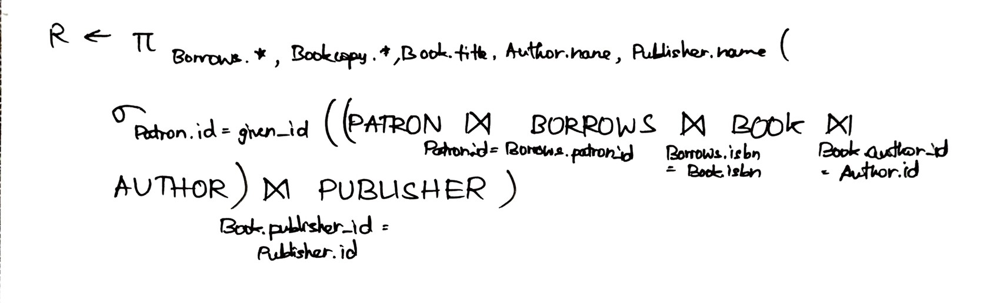

5. Retrieve all the borrow transactions for a specific book, identified by its ISBN.

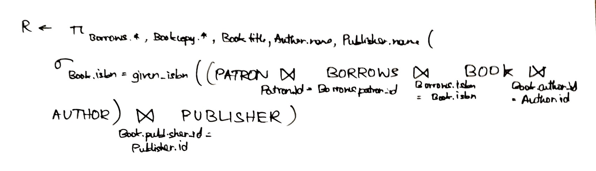

6. List all the books that are due for return on the current date.

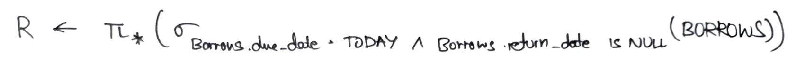

7. Find and return patrons based on their first and last names.


8. Count the total number of books.


9. Find books published by a specific publisher, identified by the publisher's name.

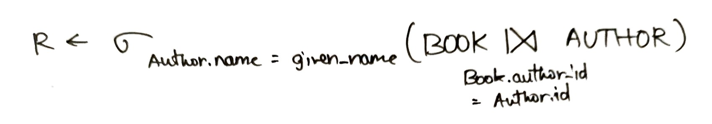

10. List books that belong to a specific genre.


---

### Python Implementation of some Notable CRUD (Create - Read - Update - Delete) functions using SQLModel ORM

There are a total of 44 CRUD functions used in this project. Here are 16 notable functions that perform database operations:

1. **`get_available_bookcopies`** - Retrieves a list of available book copies that have not been borrowed.

```python
def get_available_bookcopies(session: Session = Depends(get_session)):
    try:
        borrowed_copies_subquery = select(Borrows.copy_id).where(Borrows.return_date.is_
        (None)).subquery()
        operation = (
            select(BookCopy, Book, Author, Publisher)
            .join(Book, BookCopy.isbn == Book.isbn)
            .join(Author, Book.author_id == Author.id)
            .join(Publisher, Book.publisher_id == Publisher.id)
            .where(BookCopy.id.not_in(borrowed_copies_subquery))
        )
        result = session.exec(operation).all()
        if not result:
            return []
        
        available_bookcopies = [
            {
                "id": bookcopy.id,
                "isbn": bookcopy.isbn,
                "title": book.title,
                "author": f"{author.first_name} {author.midname_initial} 
                {author.last_name}",
                "publisher": publisher.name
            }
            for bookcopy, book, author, publisher in result
        ]
        return available_bookcopies
    except IntegrityError:
        session.rollback()
        raise DBIntegrityError
    except DatabaseError:
        session.rollback()
        raise DatabaseError
```

2. **`get_overdue_bookcopies`** - Fetches a list of book copies that are overdue for return.

```python
def get_overdue_bookcopies(session: Session = Depends(get_session)):
    try:
        today = date.today()
        operation = (
            select(Borrows, BookCopy, Book, Author, Publisher)
            .join(BookCopy, Borrows.copy_id == BookCopy.id)
            .join(Book, BookCopy.isbn == Book.isbn)
            .join(Author, Book.author_id == Author.id)
            .join(Publisher, Book.publisher_id == Publisher.id)
            .where(Borrows.due_date < today)
            .where(Borrows.return_date == None)
        )
        result = session.exec(operation).all()
        if not result:
            return []
        overdue_bookcopies = [
            {
                **borrow.dict(),
                **bookcopy.dict(),
                "title": book.title,
                "author": f"{author.first_name} {author.midname_initial} 
                {author.last_name}",
                "publisher": publisher.name
            }
            for borrow, bookcopy, book, author, publisher in result
        ]
        return overdue_bookcopies
    except IntegrityError:
        session.rollback()
        raise DBIntegrityError
    except SQLAlchemyDatabaseError:
        session.rollback()
        raise DatabaseError
```

3. **`get_all_borrows`** - Returns a list of all borrow transactions along with related book and patron details.

```python
def get_all_borrows(session: Session = Depends(get_session)):
    try:
        operation = (
            select(Borrows, BookCopy, Book, Author, Publisher)
            .join(BookCopy, Borrows.copy_id == BookCopy.id)
            .join(Book, BookCopy.isbn == Book.isbn)
            .join(Author, Book.author_id == Author.id)
            .join(Publisher, Book.publisher_id == Publisher.id)
        )
        result = session.exec(operation).all()
        if not result:
            return {
                "message": "No borrows transacted yet."
            }
        borrows = [
            {
                **borrow.dict(),
                **bookcopy.dict(),
                "title": book.title,
                "author": f"{author.first_name} {author.midname_initial} 
                {author.last_name}",
                "publisher": publisher.name
            }
            for borrow, bookcopy, book, author, publisher in result
        ]
        return borrows
    except IntegrityError:
        session.rollback()
        raise DBIntegrityError
    except SQLAlchemyDatabaseError:
        session.rollback()
        raise DatabaseError
```

4. `create_borrow` - Adds a new borrow transaction for a book copy by a patron.

```python
def create_borrow(body: AddBorrow, session: Session = Depends(get_session)):
    try:
        book_copy = session.exec(select(BookCopy).where(BookCopy.id == body.copy_id))
        .one_or_none()
        if not book_copy:
            raise NotFoundException(detail="Book copy not found")
        
        book = session.exec(select(Book).where(Book.isbn == book_copy.isbn)).one_or_none()
        if not book:
            raise NotFoundException(detail="Associated book not found")
        existing_borrow = session.exec(select(Borrows).where(Borrows.copy_id == 
        body.copy_id).where(Borrows.return_date == None)).one_or_none()
        if existing_borrow:
            raise DuplicateEntryException(detail=DUPLICATE_BORROW)
        duplicate_borrow = session.exec(select(Borrows).where(Borrows.patron_id == 
        body.patron_id).where(Borrows.copy_id == body.copy_id).where(Borrows.borrow_date 
        == body.borrow_date)).one_or_none()
        if duplicate_borrow:
            raise DuplicateEntryException(detail="This book has already been borrowed")
        borrow = Borrows(
            patron_id=body.patron_id,
            copy_id=body.copy_id,
            borrow_date=body.borrow_date,
            due_date=body.borrow_date + timedelta(days=15),
            return_date=None
        )

        patron = session.exec(select(Patron).where(Patron.id == body.patron_id))
        .one_or_none()
        if not patron:
            raise NotFoundException(detail="Patron not found")
        if patron.status != PatronStatusEnum.ACTIVE:
            patron.status = PatronStatusEnum.ACTIVE

        session.add(borrow)
        session.commit()
        session.refresh(borrow)
        return borrow

    except IntegrityError as e:
        session.rollback()
        raise DBIntegrityError
    except DatabaseError as e:
        session.rollback()
        raise DatabaseError
```

5. `return_borrow` - Updates a borrow transaction to mark a book copy as returned and adjusts the patron's status if necessary.

```python
def return_borrow(transaction_id: int, body: ReturnBorrow, session: Session = 
Depends(get_session)):
    try:
        operation = select(Borrows).where(Borrows.id == transaction_id)
        transaction = session.exec(operation)
        .one_or_none()
        if not transaction:
            raise NotFoundException(detail=BORROW_NOT_FOUND)
        transaction.return_date = body.return_date
        session.add(transaction)
        session.commit()
        patron = session.exec(select(Patron).where(Patron.id == transaction.patron_id))
        .one_or_none()
        patron_activity = False       
        for borrow in patron.borrows:
            if not borrow.return_date:
                patron_activity = True
        if patron_activity == False:
            patron.status = PatronStatusEnum.INACTIVE
        session.add(patron)
        session.commit()
        session.refresh(patron)
        return {
            "message": "Borrow returned successfully"
        }
    except IntegrityError as e:
        session.rollback()
        raise DBIntegrityError
    except DatabaseError as e:
        session.rollback()
        raise DatabaseError
```

6. **`get_borrows_by_patron`** - Retrieves all borrow transactions for a specific patron.

```python
def get_borrows_by_patron(patron_id: str, session: Session = Depends(get_session)):
    try:
        operation = (
            select(Borrows, BookCopy, Book, Author, Publisher)
            .join(BookCopy, Borrows.copy_id == BookCopy.id)
            .join(Book, BookCopy.isbn == Book.isbn)
            .join(Author, Book.author_id == Author.id)
            .join(Publisher, Book.publisher_id == Publisher.id)
            .where(Borrows.patron_id == patron_id)
        )
        result = session.exec(operation).all()
        if not result:
            return {
                "message": "No borrows found for this patron."
            }
        borrows = [
            {
                **borrow.dict(),
                **bookcopy.dict(),
                "title": book.title,
                "author": f"{author.first_name} {author.midname_initial} 
                {author.last_name}",
                "publisher": publisher.name
            }
            for borrow, bookcopy, book, author, publisher in result
        ]
        return borrows
    except IntegrityError:
        session.rollback()
        raise DBIntegrityError
    except SQLAlchemyDatabaseError:
        session.rollback()
        raise DatabaseError
```


7. **`get_borrows_by_isbn`** - Retrieves all borrow transactions for a specific book identified by its ISBN.

```python
def get_borrows_by_isbn(isbn: str, session: Session = Depends(get_session)):
    try:
        operation = (
            select(Borrows, BookCopy, Book, Author, Publisher)
            .join(BookCopy, Borrows.copy_id == BookCopy.id)
            .join(Book, BookCopy.isbn == Book.isbn)
            .join(Author, Book.author_id == Author.id)
            .join(Publisher, Book.publisher_id == Publisher.id)
            .where(BookCopy.isbn == isbn)
        )
        result = session.exec(operation).all()
        if not result:
            return {
                "message": "No borrows found for this ISBN."
            }
        borrows = [
            {
                **borrow.dict(),
                **bookcopy.dict(),
                "title": book.title,
                "author": f"{author.first_name} {author.midname_initial} 
                {author.last_name}",
                "publisher": publisher.name
            }
            for borrow, bookcopy, book, author, publisher in result
        ]
        return borrows
    except IntegrityError:
        session.rollback()
        raise DBIntegrityError
    except SQLAlchemyDatabaseError:
        session.rollback()
        raise DatabaseError
```

8. **`get_due_books`** - Returns a list of books that are due for return but have not yet been returned.

```python
def get_due_books(session: Session = Depends(get_session)):
    try:
        today = date.today()
        operation = select(Borrows).where(Borrows.due_date < today).where(Borrows
        .return_date == None)
        due_books = session.exec(operation).all()
        if not due_books:
            return []
        return due_books
    except IntegrityError as e:
        session.rollback()
        raise DBIntegrityError
    except DatabaseError as e:
        session.rollback()
        raise DatabaseError
```

9. `calculate_patron_fines` - Calculates and updates fines for patrons with overdue books.

```python
def calculate_patron_fines(session: Session = Depends(get_session)):
    try:
        today = date.today()
        operation = select(Borrows).where(Borrows.due_date < today).where(Borrows
        .return_date == None)
        overdue_books = session.exec(operation).all()
        for book in overdue_books:
            patron = session.exec(select(Patron).where(Patron.id == book.patron_id)).one()
            patron.fine += 1
            session.add(patron)
        session.commit()
    except IntegrityError as e:
        session.rollback()
        raise DBIntegrityError
    except DatabaseError as e:
        session.rollback()
        raise DatabaseError
```

10. **`get_patron_by_name`** - Finds patrons based on their first and last name.

```python
def get_patron_by_name(patron_name: str, session: Session = Depends(get_session)):
    try:
        parts = patron_name.split()    
        if len(parts) != 2:
            raise InvalidRequestException(detail=PATRON_NAME_INVALID)    
        first_name = parts[0]
        last_name = parts[1] 
        operation = select(Patron).where(Patron.first_name == first_name)
        .where(Patron.last_name == last_name).limit(3)
        patrons = session.execute(operation).all()
        if not patrons:
            raise NotFoundException(detail=PATRON_NOT_FOUND)
        patrons = [patron[0] for patron in patrons]    
        return patrons 
    except IntegrityError as e:
        session.rollback()
        raise DBIntegrityError
    except DatabaseError as e:
        session.rollback()
        raise DatabaseError
```

11. **`get_book_by_author`** - Retrieves books written by a specific author.

```python
def get_book_by_author(author_name: str, session: Session = Depends(get_session)):
    try:
        parts = author_name.split()
        first_name = parts[0]
        midname_initial = parts[1]
        last_name = parts[2]
        operation = select(Book).join(Author).where(
            Author.first_name == first_name,
            Author.midname_initial == midname_initial,
            Author.last_name == last_name
        ).limit(3)
        books = session.execute(operation).all()
        if not books:
            raise NotFoundException(detail=BOOK_NOT_FOUND)
        books = [book[0] for book in books]
        return books
    except IntegrityError as e:
        session.rollback()
        raise DBIntegrityError
    except DatabaseError as e:
        session.rollback()
        raise DatabaseError
```

12. **`get_book_by_publisher`** - Finds books published by a specific publisher.

```python
def get_book_by_publisher(publisher_name: str, session: Session):
    try:
        operation = select(Book).join(Publisher).where(
            Publisher.name == publisher_name
        ).limit(3)
        books = session.execute(operation).all()
        if not books:
            raise NotFoundException(detail=BOOK_NOT_FOUND)
        books = [book[0] for book in books]
        return books
    except IntegrityError as e:
        session.rollback()
        raise DBIntegrityError
    except DatabaseError as e:
        session.rollback()
        raise DatabaseError
```

13. **`get_book_by_genre`** - Retrieves books belonging to a specific genre.

```python
def get_book_by_genre(genre: str, session: Session):
    try:
        operation = select(Book).where(
            Book.genre == genre
        ).limit(3)
        books = session.execute(operation).all()
        if not books:
            raise NotFoundException(detail=BOOK_NOT_FOUND)
        books = [book[0] for book in books]
        return books
    except IntegrityError as e:
        session.rollback()
        raise DBIntegrityError
    except DatabaseError as e:
        session.rollback()
        raise DatabaseError
```

14. `create_patron` - Adds a new patron to the system.

```python
def create_patron(body: CreatePatron, session: Session = Depends(get_session)):
    try:
        duplicate_id = session.exec(select(Patron).where(Patron.id == body.patron_id))
        .one_or_none()
        if duplicate_id:
            raise DuplicateEntryException(detail=DUPLICATE_PATRON_ID)
        duplicate_email = session.exec(select(Patron).where(Patron.email == 
        body.patron_email)).one_or_none()
        if duplicate_email:
            raise DuplicateEntryException(detail=DUPLICATE_PATRON_EMAIL)
        duplicate_phone = session.exec(select(Patron).where(Patron.phone == 
        body.patron_phone)).one_or_none()
        if duplicate_phone:
            raise DuplicateEntryException(detail=DUPLICATE_PATRON_PHONE)
        patron = Patron(
            id = body.patron_id,
            first_name = body.patron_first_name,
            last_name = body.patron_last_name,
            email = body.patron_email,
            phone = body.patron_phone,
            status = PatronStatusEnum.INACTIVE
        )
        session.add(patron)
        session.commit()
        session.refresh(patron)
        return patron
    except IntegrityError as e:
        session.rollback()
        raise DBIntegrityError
    except DatabaseError as e:
        session.rollback()
        raise DatabaseError
```

15. `update_patron` - Updates the details of an existing patron.

```python
def update_patron(body: UpdatePatron, patron_id: str, session: Session = 
Depends(get_session)):
    try:
        operation = select(Patron).where(Patron.id == patron_id)
        patron = session.exec(operation).one_or_none()
        if not patron:
            raise NotFoundException(detail=PATRON_NOT_FOUND)
        if body.patron_first_name is not None:
            patron.first_name = body.patron_first_name
        if body.patron_last_name is not None:
            patron.last_name = body.patron_last_name
        if body.patron_email is not None:
            patron.email = body.patron_email
        if body.patron_phone is not None:
            patron.phone = body.patron_phone
        session.add(patron)
        session.commit()
        session.refresh(patron)  
        return patron      
    except IntegrityError as e:
        session.rollback()
        raise DBIntegrityError
    except DatabaseError as e:
        session.rollback()
        raise DatabaseError
```

16. `create_book` - Adds a new book and its copies to the system.

```python
def create_book(body: CreateBook, session: Session = Depends(get_session)):
    try:
        duplicate_isbn = session.exec(select(Book).where(Book.isbn == body.isbn))
        .one_or_none()
        if duplicate_isbn:
            raise NotFoundException(detail=BOOK_NOT_FOUND)
        book = Book(
            isbn = body.isbn,
            title = body.title,
            genre = body.genre,
            author_id = body.author_id,
            publisher_id = body.publisher_id,
            published_year = body.published_year,
            qty = body.qty
        )
        session.add(book)
        book_copies = [BookCopy(isbn=body.isbn) for _ in range(body.qty)]
        session.bulk_save_objects(book_copies)
        session.commit()
        session.refresh(book)
        return book
    except IntegrityError as e:
        session.rollback()
        raise DBIntegrityError
    except DatabaseError as e:
        session.rollback()
        raise DatabaseError
```

---

# SQL Create Statements 

```
CREATE TABLE author (
	id INTEGER NOT NULL, 
	first_name VARCHAR(25) NOT NULL, 
	midname_initial VARCHAR(25) NOT NULL, 
	last_name VARCHAR(25) NOT NULL, 
	PRIMARY KEY (id)
)

CREATE TABLE book (
	isbn VARCHAR(13) NOT NULL, 
	title VARCHAR(255) NOT NULL, 
	genre VARCHAR(25) NOT NULL, 
	author_id INTEGER NOT NULL, 
	publisher_id INTEGER NOT NULL, 
	published_year INTEGER NOT NULL, 
	qty INTEGER NOT NULL, 
	PRIMARY KEY (isbn), 
	FOREIGN KEY(author_id) REFERENCES author (id), 
	FOREIGN KEY(publisher_id) REFERENCES publisher (id)
)

CREATE TABLE bookcopy (
	id INTEGER NOT NULL, 
	isbn VARCHAR(13) NOT NULL, 
	PRIMARY KEY (id), 
	FOREIGN KEY(isbn) REFERENCES book (isbn)
)

CREATE TABLE borrows (
	id INTEGER NOT NULL, 
	patron_id VARCHAR(10) NOT NULL, 
	copy_id INTEGER NOT NULL, 
	borrow_date DATE NOT NULL, 
	due_date DATE NOT NULL, 
	return_date DATE, 
	PRIMARY KEY (id), 
	FOREIGN KEY(patron_id) REFERENCES patron (id), 
	FOREIGN KEY(copy_id) REFERENCES bookcopy (id)
)

CREATE TABLE patron (
	id VARCHAR(10) NOT NULL, 
	first_name VARCHAR(25) NOT NULL, 
	last_name VARCHAR(25) NOT NULL, 
	email VARCHAR(50) NOT NULL, 
	phone VARCHAR(10) NOT NULL, 
	status VARCHAR(8) NOT NULL, 
	fine INTEGER NOT NULL, 
	PRIMARY KEY (id), 
	UNIQUE (email), 
	UNIQUE (phone)
)

CREATE TABLE publisher (
	id INTEGER NOT NULL, 
	name VARCHAR(50) NOT NULL, 
	PRIMARY KEY (id)
)
```

--- 

### Endpoints
#### Author Endpoints

- **POST `/author/`**: Create a new author.
- **GET `/author/all`**: Retrieve all authors.
- **GET `/author/count`**: Get the count of all authors.
- **GET `/author/name/{author_name}`**: Retrieve authors by name.
- **PATCH `/author/{author_id}`**: Update an author by ID.
- **DELETE `/author/{author_id}`**: Delete an author by ID.

#### Book Endpoints

- **POST `/book/`**: Create a new book.
- **GET `/book/all`**: Retrieve all books.
- **GET `/book/count`**: Get the count of all books.
- **GET `/book/isbn/{isbn}`**: Retrieve books by ISBN.
- **GET `/book/title/{title}`**: Retrieve books by title.
- **GET `/book/genre/{genre}`**: Retrieve books by genre.
- **GET `/book/author/{author_name}`**: Retrieve books by author.
- **GET `/book/publisher/{publisher_name}`**: Retrieve books by publisher.
- **PATCH `/book/{isbn}`**: Update a book by ISBN.
- **DELETE `/book/{isbn}`**: Delete a book by ISBN.

#### BookCopy Endpoints

- **GET `/bookcopy/count`**: Get the count of all book copies.
- **GET `/bookcopy/overdue`**: Retrieve overdue book copies.
- **GET `/bookcopy/available`**: Retrieve available book copies.
- **GET `/bookcopy/unreturnedcount`**: Get the count of unreturned book copies.

#### Borrow Endpoints

- **POST `/borrows/`**: Create a new borrow transaction.
- **GET `/borrows/all`**: Retrieve all borrow transactions.
- **GET `/borrows/count`**: Get the count of all borrow transactions.
- **PUT `/borrows/return/{transaction_id}`**: Return a borrowed book.
- **GET `/borrows/patron/{patron_id}`**: Retrieve borrow transactions by patron ID.
- **GET `/borrows/isbn/{isbn}`**: Retrieve borrow transactions by book ISBN.

#### Patron Endpoints

- **POST `/patron/`**: Create a new patron.
- **GET `/patron/all`**: Retrieve all patrons.
- **GET `/patron/count`**: Get the count of all patrons.
- **GET `/patron/id/{patron_id}`**: Retrieve patrons by ID.
- **GET `/patron/name/{patron_name}`**: Retrieve patrons by name.
- **GET `/patron/fine/{fine}`**: Retrieve patrons by fine amount.
- **GET `/patron/finetotal`**: Get the total fines of all patrons.
- **PATCH `/patron/{patron_id}`**: Update a patron by ID.
- **DELETE `/patron/{patron_id}`**: Delete a patron by ID.

#### Publisher Endpoints

- **POST `/publisher/`**: Create a new publisher.
- **GET `/publisher/all`**: Retrieve all publishers.
- **GET `/publisher/count`**: Get the count of all publishers.
- **GET `/publisher/name/{publisher_name}`**: Retrieve publishers by name.
- **PATCH `/publisher/{publisher_id}`**: Update a publisher by ID.
- **DELETE `/publisher/{publisher_id}`**: Delete a publisher by ID.

---

# Tech Stack

- The `biblio` backend uses a REST API Python backend framework called FastAPI. All endpoints, requests, and retrievals are done via the FastAPI server code

- The `biblio` backend uses an SQLite database with an SQLModel ORM that implements queries in Python Code. All models are designed using SQLModel. Request Validation is done using Pydantic models.

- The `biblio` frontend uses Streamlit for a blazing-fast, simple yet intuitive interface.

--- 

# Instructions 

`biblio` uses docker for containerization. One can pull the project to a local repository, `cd` into the repository and run `sudo docker-compose up --build`. Ports 8000 and 8051 need to be left free in order to run the application. The application can be accessed at l`http://0.0.0.0:8051/`

---

# Conclusion

The Biblio Library Management System showcases a comprehensive and modern approach to library management software. Key features and strengths of the system include:

1. **Robust Backend**: Implemented using FastAPI, the backend provides a fast, efficient, and well-structured API for all library operations.

2. **User-Friendly Frontend**: The Streamlit-based frontend offers an intuitive and responsive user interface, making library management tasks accessible and straightforward.

3. **Comprehensive CRUD Operations**: The system provides full Create, Read, Update, and Delete functionality for all major entities (books, authors, publishers, patrons, borrows).

4. **Advanced Search Capabilities**: Users can search for books, authors, publishers, and patrons using various criteria, enhancing the system's usability.

5. **Automated Tasks**: The background scheduler for calculating patron fines demonstrates the system's capability for automation, reducing manual workload.

6. **Data Integrity**: Through the use of SQLModel and Pydantic, the system ensures data validation and integrity at both the database and application levels.

7. **Scalable Architecture**: The modular design, with separate routers for each resource, allows for easy maintenance and future expansion.

8. **Containerization**: Docker and Docker Compose integration ensures easy deployment and consistency across different environments.

9. **Detailed Reporting**: The system provides various aggregate functions and reports, offering valuable insights into library operations.

10. **Flexible and Extensible**: The well-structured codebase allows for easy addition of new features or modification of existing ones.

In conclusion, the Biblio Library Management System represents a powerful, flexible, and user-friendly solution for modern libraries. Its combination of a robust backend, intuitive frontend, and comprehensive feature set makes it well-suited for libraries of various sizes and complexities. The system's architecture and implementation demonstrate best practices in software development, ensuring maintainability, scalability, and reliability.

---

### Powered by

- SQLModel
- FastAPI
- Docker
- Streamlit

---

### Relevant Screenshots

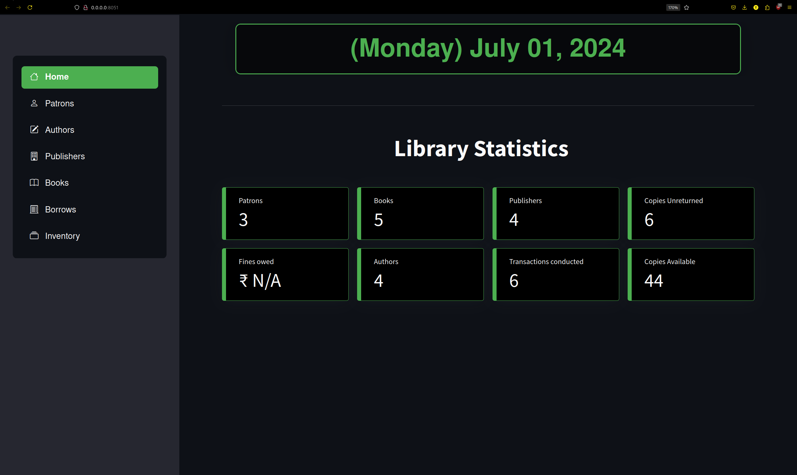
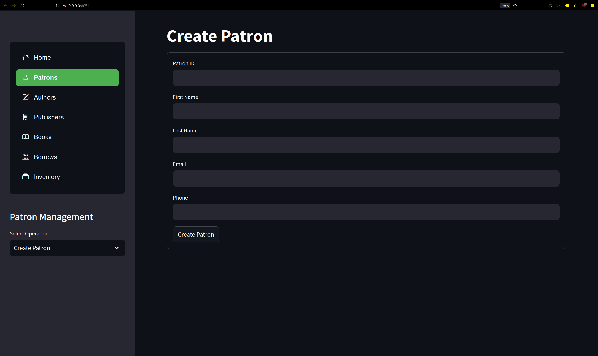
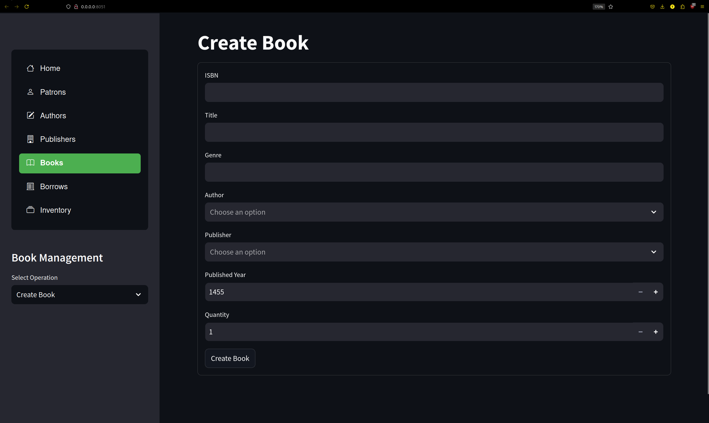
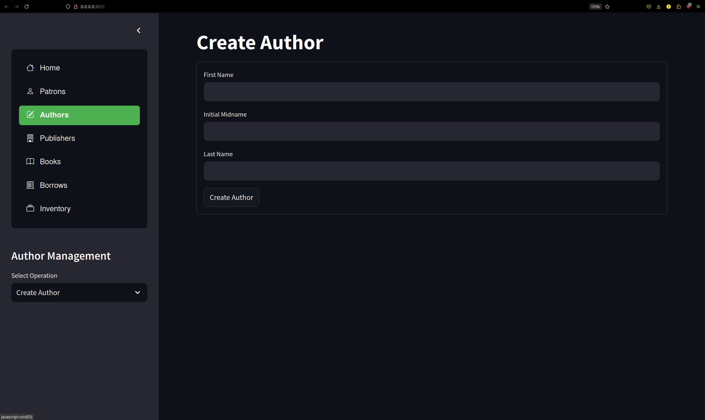
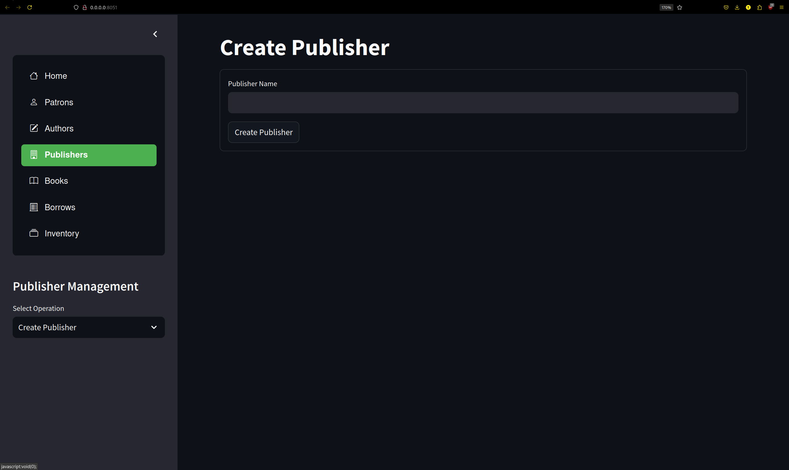
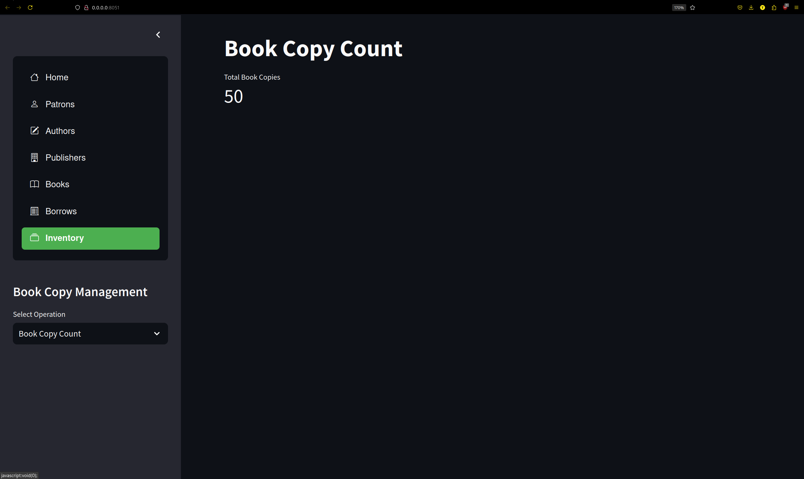
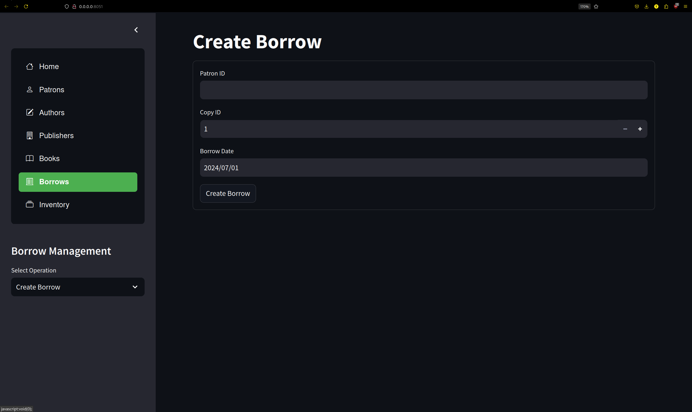

---